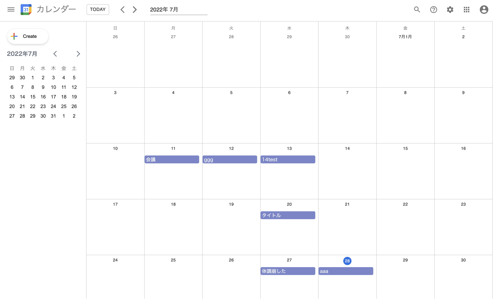
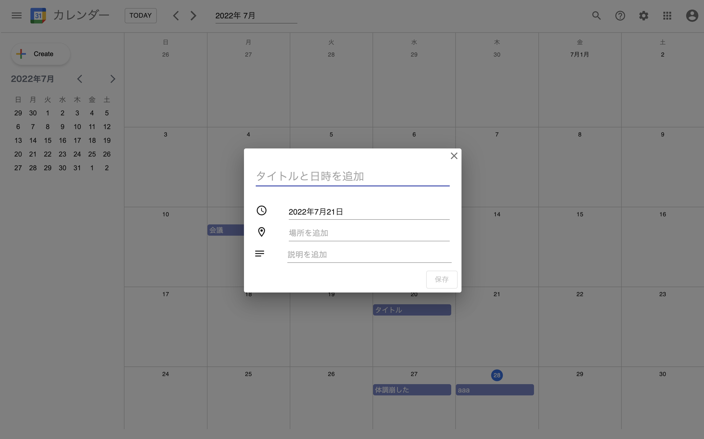
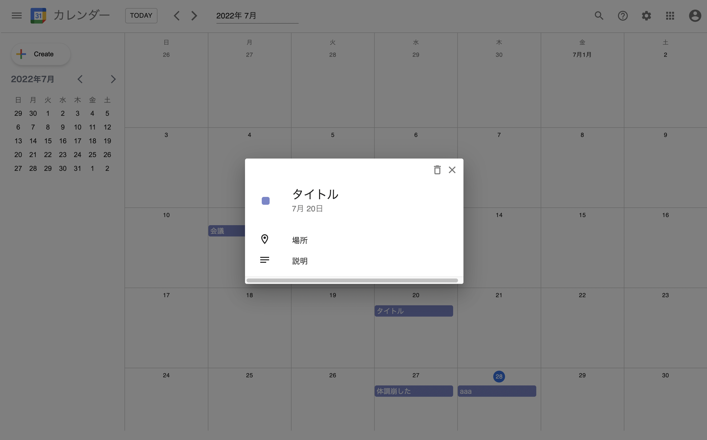

# Calender-go
 
React, redux, GoのAPIserverでgoogle Calendarを作成！
 
# DEMO
 



  
# Requirement
 
* react 18.2.0
* redux 4.2.0
* redux-thunk 2.4.1
* hogehuga 1.0.2
* dayjs 1.11.3
* Material-UI
 
# Installation
 
Requirementで列挙したライブラリなどのインストール方法を説明する
 
```bash
pip install huga_package
```
 
# Usage
 
DEMOの実行方法など、"hoge"の基本的な使い方を説明する
 
```bash
git clone https://github.com/hoge/~
cd examples
python demo.py
```

# Function

* カレンダーのロジック作成・表示
* カレンダーの月の切り替え
* 予定の追加
* 予定の詳細表示
* 予定の削除
* サーバーからデータの取得と保存
# Note
 
注意点などがあれば書く
 
# Author
 
作成情報を列挙する
 
* 作成者
* 所属
* E-mail
 
# License
ライセンスを明示する
 
"hoge" is under [MIT license](https://en.wikipedia.org/wiki/MIT_License).
 
社内向けなら社外秘であることを明示してる
 
"hoge" is Confidential.